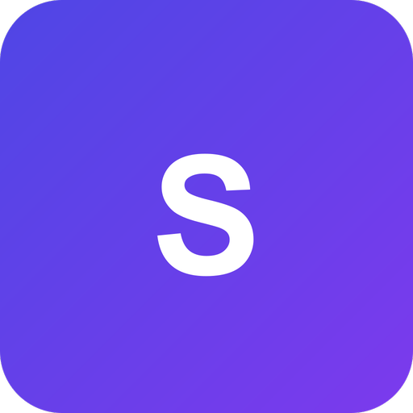

<p align="center">
  
</p>

<h1 align="center">Grafyn</h1>

<p align="center">
  A local-first knowledge vault and multi-model AI canvas that captures the evidence for your personal digital twin.
  <br>
  <strong>Windows</strong> &middot; <strong>macOS</strong> &middot; <strong>Linux</strong>
</p>

<p align="center">
  <a href="https://github.com/WKJBryan/Grafyn/releases/latest"></a>
  <a href="LICENSE"></a>
  <a href="https://github.com/WKJBryan/Grafyn/actions/workflows/test.yml"></a>
  <a href="https://github.com/WKJBryan/Grafyn/releases"></a>
</p>

<p align="center">
  <a href="#install">Install</a> &middot;
  <a href="#what-you-get">What You Get</a> &middot;
  <a href="#the-twin">The Twin</a> &middot;
  <a href="#privacy--your-data">Privacy</a> &middot;
  <a href="#project-status">Status</a> &middot;
  <a href="CONTRIBUTING.md">Contributing</a>
</p>

---

**Grafyn is three things that feed each other:**

1. **A knowledge vault** — plain markdown notes with `[[wikilinks]]`, full-text search, and an auto-organized knowledge graph. Your files, on your disk, readable by anything.
2. **A multi-model canvas** — ask several AI models the same question side by side, with your own notes automatically retrieved as context. Compare, branch, make them debate.
3. **A twin evidence recorder** — as you work, Grafyn captures how you think: what you accept, reject, correct, and prefer. That evidence powers an experimental retrieval-based "digital twin" today, and exports cleanly for whatever you want to train tomorrow.

Core storage, indexing, projection, and review run on your machine. Network traffic occurs only through features you configure or invoke, such as model requests, optional web search, update checks, and explicit sync/export transport.

> **Early development** — the vault and canvas are solid daily tools; the twin is an honest experiment. See [Project Status](#project-status) for exactly what's stable.

## Install

Download the latest installer from [Releases](https://github.com/WKJBryan/Grafyn/releases/latest):

| Platform | File |
|----------|------|
| Windows x64 | `Grafyn_*_x64-setup.exe` |
| Windows ARM64 | `Grafyn_*_arm64-setup.exe` |
| macOS Apple Silicon | `Grafyn_*_aarch64.dmg` |
| Linux Debian/Ubuntu | `grafyn_*_amd64.deb` |
| Linux Universal | `grafyn_*_amd64.AppImage` |

Grafyn auto-updates after installation.

**First run** walks you through two things:

1. **Vault path** — where your markdown notes live (default `~/Documents/Grafyn/vault/`). Point it at an existing folder of markdown and Grafyn indexes it.
2. **OpenRouter API key** — powers the canvas, note distillation, and twin answers. Optional if you only want the vault, or run models locally via [Ollama](https://ollama.com/) instead.

To build from source instead, see [CONTRIBUTING.md](CONTRIBUTING.md).

## What You Get

### A vault that organizes itself

Write markdown with `[[wikilinks]]`; Grafyn builds the backlink graph, full-text search (Tantivy), and a D3 graph view. Topic hubs are created and maintained automatically — broad clusters, not a folder per stray tag. A background service continuously suggests links you missed, and a vault optimizer tidies note structure with per-change rollback and a daily write cap.

Already have your thinking scattered across AI chats? **Import conversations** from ChatGPT, Claude, Grok, and Gemini exports — plus DOCX and PDF documents — as linked, searchable notes. Larger "container" notes can be distilled into focused atomic notes with a topic hub index.

### A canvas for working with many models at once

Send one prompt to multiple models (any OpenRouter model, or local Ollama models) and watch them stream side by side. Branch from any answer, add models to a comparison, regenerate, or start a structured **debate** where models critique and synthesize. The canvas retrieves relevant notes from your vault as context automatically — keyword search boosted by your link graph — and can pin notes you always want included. Sessions persist and export back into the vault as notes.

### Your notes, everywhere your AI agents are

Grafyn bundles `grafyn-mcp`, a native [MCP](https://modelcontextprotocol.io/) server, so Claude Desktop and other MCP clients can search, read, and write your vault directly. Settings generates the config snippet with your paths filled in:

```json
{
  "mcpServers": {
    "grafyn": {
      "command": "path/to/grafyn-mcp",
      "args": ["--vault", "path/to/vault", "--data", "path/to/data"]
    }
  }
}
```

It shares the vault and indexes with the app, falling back to read-only search when the app holds the index writer.

## The Twin

The long-term bet: the hardest part of a personal AI isn't the model — it's the evidence. Grafyn is built to capture that evidence as a side effect of work you're doing anyway.

Canvas feedback and branching are retained as evidence, not silently promoted into truth. A separate **Capture Twin preference** action accepts only user-written text tied to a completed persisted global response. Three matching captures from three distinct responses produce a pending proposal; that proposal still needs explicit review before it can ground Advisor or Simulation. Other feedback and generic insights remain claim-empty evidence. The **Twin Workspace** (`/twin`) keeps proposal review and legacy record governance visible.

What that enables today, all **experimental**:

- **Advisor mode** — a decision-support assistant grounded in your reviewed records and notes.
- **Simulation mode** — a first-person twin voice, gated behind an explicit Twin Identity setup (name, role, source boundaries), reasoning from your reviewed Constitution and evidence.
- **Decision Mirror** — sealed predictions of what you'd choose, recorded before you choose, so twin accuracy can be measured honestly later.

Records you mark `rejected`, `private`, or `no_train` are never used in live answers. Rejected records are kept only as negative evidence for export.

**Training happens outside Grafyn, by design.** The app's job is capture and export: reviewed records ship as clean JSONL bundles (approved / candidate / rejected splits) for whatever pipeline you point them at — RAG today, preference models or fine-tuning later. The accuracy machinery that would make twin answers trustworthy (embedding-based retrieval, temporal validity, calibrated confidence) is roadmap work, tracked openly in [TWIN_ACCURACY_ROADMAP.md](TWIN_ACCURACY_ROADMAP.md). The full design is in [TWIN_RAG_SPEC.md](TWIN_RAG_SPEC.md).

## Privacy & Your Data

- **Local-first, no hosted backend.** Notes and the Markdown vault are local, while canonical Twin events, settings, caches, and secret references also live in OS application storage. A complete deletion must remove both the vault and Grafyn's OS app data/config/cache, plus its keychain/Keystore entries.
- **What leaves your machine:** only traffic for a feature you configure or invoke: model prompts/context, optional web search, update checks, explicit feedback, and manual sync/export transport. Ollama can keep model prompts local.
- **Your API key** is stored in the OS keychain, not in config files.
- **Twin evidence is yours.** Nothing is trained on your data by Grafyn; exports exist so *you* can train elsewhere, on your terms.

## Project Status

| Area | Status |
|------|--------|
| Knowledge vault (notes, wikilinks, full-text search) | ✅ Stable |
| Knowledge graph + topic hub clustering | ✅ Stable |
| Multi-LLM Canvas with graph-aware note context | ✅ Stable |
| Conversation import (ChatGPT, Claude, Grok, Gemini) | ✅ Stable |
| Local model support via Ollama | ✅ Stable |
| Background link discovery | ✅ Stable |
| Vault Optimizer (background vault improvements) | ✅ Stable |
| Structured vault migration (preview/apply/rollback) | ✅ Stable |
| MCP server (`grafyn-mcp`) for Claude Desktop / Codex Desktop | ✅ Stable |
| Android compact companion | 🧪 Early; installed-app native verification is still pending |
| Local manual E2EE sync foundation | 🧪 Experimental; no hosted relay, account, or pairing service |
| Native RAG twin (Advisor + Simulation modes) | 🧪 Experimental |
| Twin Identity, Constitution, Decision Mirror | 🧪 Experimental |
| Twin evidence capture and review dashboard | 🧪 Experimental |
| Preference / ranking model from export bundles | 🔲 Not started |
| Local adapters or fine-tuning from reviewed evidence | 🔲 Not started |

Twin data capture and export are dependable today; twin *accuracy* is not yet a claim we make — see [TWIN_ACCURACY_ROADMAP.md](TWIN_ACCURACY_ROADMAP.md) for what's missing and in what order.

## Architecture

One shared Rust library powers target-specific Tauri 2 shells. Desktop releases bundle the thin `grafyn` app binary and the standalone `grafyn-mcp` sidecar; Android packages the same core behind a smaller command allowlist and app-private storage. A feature-gated `grafyn-test-runtime` binary exists only for development system tests and is excluded from release capabilities.

```text
Tauri 2 shared Rust core
├── Desktop-wide shell    Notes · Graph · spatial Canvas · Twin Workspace
├── Android companion     Capture · Recall · Twin review/chat · linear Canvas
├── Local data            Markdown vault · indexes · events · projections
└── grafyn-mcp            Desktop-only stdio server sharing the desktop vault
```

| Layer | Technology |
|-------|------------|
| Frontend | Vue 3, Vite, Pinia, D3.js |
| App shells | Tauri 2 (desktop and Android) |
| Backend | Rust |
| Search | Tantivy |
| LLM runtime | OpenRouter (reqwest) · Ollama for local models |
| MCP | rmcp over stdio |
| Updates | Cloudflare R2 + Workers |

Deeper architecture notes live in [CLAUDE.md](CLAUDE.md).

## Editions and licensing

The open client and local core in this repository are available under [MPL-2.0](LICENSE). The existing [`grafyn-sync-protocol`](frontend/src-tauri/crates/grafyn-sync-protocol) crate is available under `Apache-2.0 OR MPL-2.0` to support independent implementations.

The approved design also leaves room for a future optional hosted service that relays opaque end-to-end encrypted operations. That hosted service, along with billing and operations, is a separate proprietary boundary and is not currently available. Local capture, recall, export, and access to local data do not depend on it.

See [RELICENSING.md](RELICENSING.md) for the provenance audit and change record, [CONTRIBUTING.md](CONTRIBUTING.md) for DCO sign-off, and [TRADEMARKS.md](TRADEMARKS.md) for the name and logo policy.

## Contributing

Contributions are welcome — the project has a full CI pipeline (tests, lint, multi-platform release smoke) and firm product rules around twin data ethics and local-first storage. Start with [CONTRIBUTING.md](CONTRIBUTING.md) for setup, test commands, and the rules that keep the twin honest.

## License

[MPL-2.0](LICENSE) — modifications to covered source files remain available under the MPL's file-level terms.
