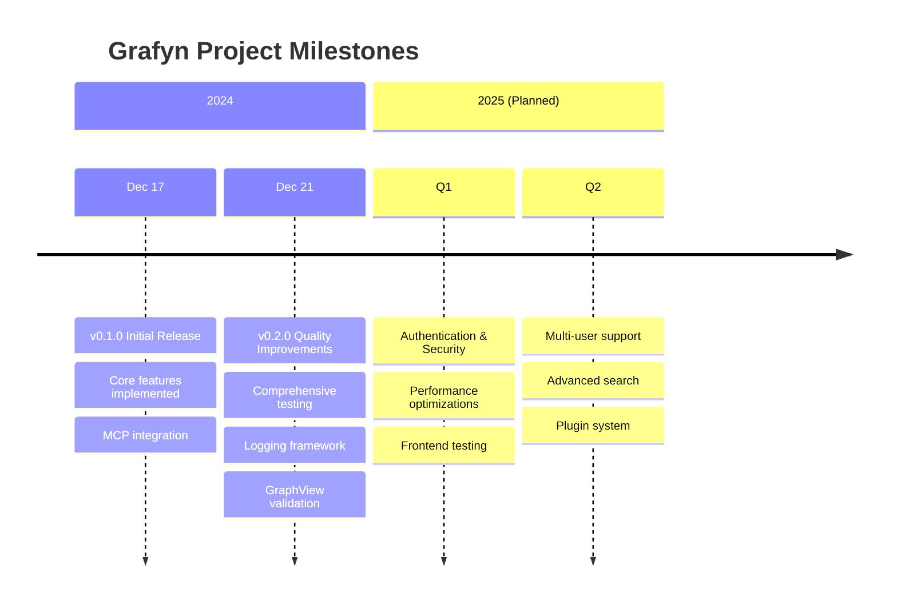

# Grafyn Project Milestones

> **Purpose:** Track key achievements, releases, and project milestones
> **Created:** 2025-12-31
> **Status:** Active

## Milestone Timeline

## Completed Milestones

### M1: Project Inception (2024-11)

**Date:** November 2024
**Status:** ✅ Complete

**Achievements:**
- Defined project vision and goals
- Selected technology stack
- Designed initial architecture
- Created project repository

**Deliverables:**
- Project proposal document
- Technology stack decision
- Initial architecture design
- Repository setup

---

### M2: MVP Development (2024-12-01 to 2024-12-15)

**Date:** December 1-15, 2024
**Status:** ✅ Complete

**Achievements:**
- Implemented FastAPI backend
- Created Vue 3 frontend
- Integrated LanceDB for vector storage
- Implemented semantic search
- Added wikilink parsing and backlinks

**Deliverables:**
- Working backend with 4 services
- Functional frontend with 5 components
- Semantic search capability
- Knowledge graph features
- Basic documentation

**Metrics:**
- 80+ API endpoints
- 14+ backend services
- 9 MCP tools
- 20+ Vue components

---

### M3: MCP Integration (2024-12-16)

**Date:** December 16, 2024
**Status:** ✅ Complete

**Achievements:**
- Integrated fastapi-mcp
- Exposed 6 MCP tools
- Created Claude Desktop configuration guide
- Tested MCP connectivity

**Deliverables:**
- MCP server at `/mcp` endpoint
- 6 functional MCP tools
- Setup documentation
- Chat ingestion workflows

**MCP Tools:**
1. `list_notes` - List all notes
2. `get_note` - Retrieve note content
3. `create_note` - Create a new note
4. `update_note` - Update an existing note
5. `delete_note` - Delete a note
6. `search_notes` - Full-text search
7. `get_backlinks` - Get note backlinks
8. `get_outgoing` - Get outgoing links
9. `recall_relevant` - Semantic recall from memory

---

### M4: v0.1.0 Release (2024-12-17)

**Date:** December 17, 2024
**Status:** ✅ Complete

**Achievements:**
- Stabilized MVP features
- Created comprehensive documentation
- Published initial release
- Established development workflow

**Deliverables:**
- v0.1.0 release
- Complete documentation set
- README and setup guides
- API documentation

**Release Notes:**
- Core note CRUD operations
- Semantic search with embeddings
- Knowledge graph with backlinks
- MCP integration for AI assistants
- Web-based UI

---

### M5: Quality Improvements (2024-12-18 to 2024-12-21)

**Date:** December 18-21, 2024
**Status:** ✅ Complete

**Achievements:**
- Implemented comprehensive test suite
- Added proper logging framework
- Fixed code quality issues
- Validated GraphView component

**Deliverables:**
- 100+ tests (1,600+ lines)
- Logging configuration
- Test infrastructure
- Improved documentation

**Metrics:**
- 70%+ test coverage target
- 100% logging coverage
- 5 test files (4 unit, 1 integration)
- Fixed 3 code quality issues

---

### M6: v0.2.0 Release (2024-12-21)

**Date:** December 21, 2024
**Status:** ✅ Complete

**Achievements:**
- Released quality improvements
- Updated documentation
- Established testing culture
- Improved developer experience

**Deliverables:**
- v0.2.0 release
- Updated documentation
- Test suite
- Logging framework
- Improvements summary

**Release Notes:**
- Comprehensive test suite
- Proper logging framework
- Code quality improvements
- GraphView validation
- Better error handling

---

## In-Progress Milestones

### M7: Memory Bank Initialization (2024-12-31)

**Date:** December 31, 2024
**Status:** 🚧 In Progress

**Objectives:**
- Create comprehensive memory bank structure
- Document project history and evolution
- Capture architecture decisions
- Document development patterns
- Record known issues and solutions

**Deliverables:**
- Memory bank directory structure
- Project context documentation
- Architecture Decision Records (ADRs)
- Development patterns and conventions
- Known issues and solutions
- Configuration reference
- Quick reference guides
- Development workflows

**Progress:**
- ✅ Memory bank structure designed
- ✅ README created
- 🚧 Project context documentation
- ⏳ Architecture decisions
- ⏳ Development patterns
- ⏳ Known issues
- ⏳ Configuration reference
- ⏳ Quick reference
- ⏳ Workflows

---

## Planned Milestones

> **Note:** These milestones were defined during initial planning (Q1/Q2 2025 targets). The project has since evolved significantly with Tauri desktop app, multi-LLM canvas, distillation module, and conversation import features.

### M8: Security Hardening (Q1 2025)

**Target:** Q1 2025
**Status:** 📅 Planned

**Objectives:**
- Implement authentication layer
- Add authorization controls
- Improve CORS configuration
- Enhance input validation
- Add rate limiting

**Deliverables:**
- Authentication system (JWT/OAuth)
- Role-based access control
- Secure CORS configuration
- Enhanced input sanitization
- Rate limiting middleware

**Success Criteria:**
- All endpoints require authentication
- Role-based permissions working
- CORS restricted to specific origins
- Security audit passed

---

### M9: Performance Optimization (Q1 2025)

**Target:** Q1 2025
**Status:** 📅 Planned

**Objectives:**
- Implement pagination for large datasets
- Add caching layer for search results
- Optimize graph operations
- Improve frontend performance
- Add performance monitoring

**Deliverables:**
- Pagination for `/api/notes` endpoint
- Redis or in-memory cache
- Optimized graph algorithms
- Lazy loading for large graphs
- Performance metrics dashboard

**Success Criteria:**
- Handle 10,000+ notes efficiently
- Search response < 200ms
- Graph rendering < 500ms
- Page load < 1s

---

### M10: Frontend Testing (Q1 2025)

**Target:** Q1 2025
**Status:** 📅 Planned

**Objectives:**
- Set up Vitest and @vue/test-utils
- Write component tests
- Add E2E tests with Playwright
- Achieve 70%+ frontend coverage

**Deliverables:**
- Vitest configuration
- Component tests for all 6 components
- E2E test suite
- Test documentation
- CI/CD integration

**Success Criteria:**
- All components tested
- Key user flows covered by E2E tests
- 70%+ code coverage
- Tests run in CI/CD

---

### M11: Multi-User Support (Q2 2025)

**Target:** Q2 2025
**Status:** 📅 Planned

**Objectives:**
- Implement user management
- Add permission system
- Support collaborative editing
- Add user-specific views
- Implement audit logging

**Deliverables:**
- User registration and authentication
- Role and permission system
- Note sharing and collaboration
- User profiles and preferences
- Audit log for all operations

**Success Criteria:**
- Multiple users can work simultaneously
- Granular permissions working
- No data loss during concurrent edits
- Complete audit trail

---

### M12: Advanced Search (Q2 2025)

**Target:** Q2 2025
**Status:** 📅 Planned

**Objectives:**
- Add advanced search filters
- Implement faceted search
- Add search history
- Support saved searches
- Improve search relevance

**Deliverables:**
- Filter by tags, status, date range
- Faceted search UI
- Search history and suggestions
- Saved search functionality
- Relevance tuning and feedback

**Success Criteria:**
- Complex queries supported
- Search results more relevant
- User can save and reuse searches
- Search performance maintained

---

### M13: Plugin System (Q2 2025)

**Target:** Q2 2025
**Status:** 📅 Planned

**Objectives:**
- Design plugin architecture
- Create plugin API
- Implement plugin loader
- Add plugin marketplace
- Document plugin development

**Deliverables:**
- Plugin specification
- Plugin API documentation
- Plugin manager UI
- Sample plugins
- Plugin marketplace (optional)

**Success Criteria:**
- Plugins can extend core functionality
- Plugin development is straightforward
- Plugins are isolated and secure
- Community can contribute plugins

---

### M14: v1.0.0 Release (Q2 2025)

**Target:** Q2 2025
**Status:** 📅 Planned

**Objectives:**
- Feature-complete for production use
- Security hardening complete
- Performance optimized
- Comprehensive testing
- Production-ready documentation

**Deliverables:**
- v1.0.0 release
- Production deployment guide
- Security audit report
- Performance benchmarks
- Complete documentation

**Success Criteria:**
- All MVP features stable
- Security audit passed
- Performance benchmarks met
- 80%+ test coverage
- Production-ready

---

## Metrics and KPIs

### Development Metrics

| Metric | v0.1.0 | v0.0.6 | v1.0.0 (Target) |
|--------|--------|--------|-----------------|
| API Endpoints | 14 | 80+ | 20+ |
| Backend Services | 4 | 14+ | 6+ |
| Vue Components | 5 | 20+ | 10+ |
| Test Coverage | 0% | 70% | 80%+ |
| Documentation | Basic | Comprehensive | Complete |

### Quality Metrics

| Metric | v0.1.0 | v0.2.0 | v1.0.0 (Target) |
|--------|--------|--------|-----------------|
| Known Issues | 5 | 0 | 0 |
| Security Issues | 3 | 3 | 0 |
| Performance Issues | 2 | 2 | 0 |
| Test Failures | N/A | 0 | 0 |

### User Metrics (Future)

| Metric | Target | Notes |
|--------|--------|-------|
| Active Users | 100+ | First 6 months |
| Notes Created | 10,000+ | First 6 months |
| Search Queries | 50,000+ | First 6 months |
| MCP Tool Calls | 20,000+ | First 6 months |

## Milestone Tracking

### How Milestones Are Defined

1. **Strategic Goals**: Align with project vision
2. **Measurable Outcomes**: Clear success criteria
3. **Time-Bound**: Specific target dates
4. **Dependencies**: Identify prerequisites
5. **Resources**: Estimate effort and requirements

### Milestone Review Process

1. **Planning**: Define objectives and deliverables
2. **Execution**: Implement features and improvements
3. **Validation**: Test and verify success criteria
4. **Documentation**: Record outcomes and lessons
5. **Review**: Evaluate and plan next steps

### Milestone Status

- ✅ **Complete**: All objectives achieved
- 🚧 **In Progress**: Work actively underway
- ⏸️ **Blocked**: Waiting on dependencies
- 📅 **Planned**: Scheduled for future
- ❌ **Cancelled**: No longer relevant

## Lessons Learned

### What Worked Well

1. **Incremental Milestones**: Breaking work into smaller milestones made progress visible
2. **Clear Objectives**: Well-defined goals helped focus efforts
3. **Regular Reviews**: Frequent check-ins kept work on track
4. **Documentation**: Recording decisions and outcomes improved future planning

### What Could Be Better

1. **Earlier Testing**: Should have started testing from the beginning
2. **Security Planning**: Should have considered security earlier in the process
3. **Performance Testing**: Need to test with realistic data volumes
4. **User Feedback**: Should gather user feedback earlier in development

---

**See Also:**
- [Project History](./history.md) - Origins and background
- [Project Evolution](./evolution.md) - How the project has changed
- [ADR Index](../02-architecture-decisions/README.md) - Architecture decisions
