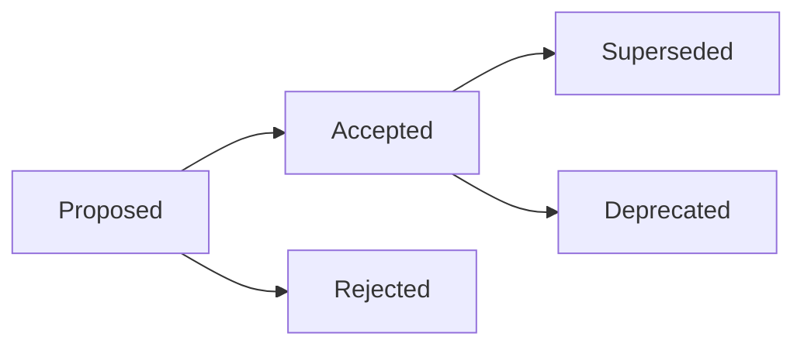

# Architecture Decision Records (ADRs)

> **Purpose:** Record significant architectural decisions made in the Grafyn project
> **Format:** Based on Michael Nygard's ADR template
> **Status:** Active

## What is an ADR?

An Architecture Decision Record (ADR) captures a significant architectural decision, the context, the alternatives considered, and the consequences. Each ADR is:

- **Numbered sequentially** for easy reference
- **Written in the past tense** (decision already made)
- **Focused on a single decision** (one decision per ADR)
- **Immutable** (if the decision changes, create a new ADR)

## ADR Index

| ADR | Title | Status | Date |
|-----|-------|--------|------|
| [ADR-001](./adr-001-technology-stack.md) | Technology Stack Selection | Accepted | 2024-11-01 |
| [ADR-002](./adr-002-architecture-pattern.md) | Service Layer Architecture Pattern | Accepted | 2024-11-05 |
| [ADR-003](./adr-003-mcp-integration.md) | MCP Integration for AI Assistants | Accepted | 2024-12-10 |
| [ADR-004](./adr-004-data-model.md) | Note Data Model and Wikilinks | Accepted | 2024-11-15 |
| [ADR-005](./adr-005-embedding-model.md) | Embedding Model Selection | Accepted | 2024-11-20 |

## ADR Template

When creating a new ADR, use this template:

```markdown
# ADR-XXX: [Decision Title]

## Status
[Proposed | Accepted | Deprecated | Superseded]

## Date
[YYYY-MM-DD]

## Context
[What is the issue that we're seeing that is motivating this decision or change?]

## Decision
[What is the change that we're proposing and/or doing?]

## Consequences
[What becomes easier or more difficult to do because of this change?]

## Alternatives Considered
[What other approaches did we consider, and why did we reject them?]

## References
[Links to relevant documentation, discussions, or resources]
```

## How to Use This Directory

### Reading ADRs

1. **Start with the index**: Use the table above to find relevant ADRs
2. **Read in order**: ADRs build on each other, so read them chronologically
3. **Check status**: Only "Accepted" ADRs represent current decisions
4. **Follow references**: Check linked documents for more context

### Creating New ADRs

1. **Number sequentially**: Use the next available number
2. **Use the template**: Copy the template above
3. **Be specific**: Focus on a single decision
4. **Document alternatives**: Show you've considered options
5. **Update the index**: Add your ADR to the table above

### Updating ADRs

**Important:** ADRs are immutable. If a decision changes:

1. **Create a new ADR** with the next number
2. **Reference the old ADR** in the context
3. **Mark the old ADR** as "Superseded" or "Deprecated"
4. **Update the index** to reflect the change

## ADR Categories

### Technology Decisions
- Technology stack choices
- Framework and library selections
- Database and storage decisions

### Architecture Decisions
- System architecture patterns
- Component organization
- Data flow and integration

### Process Decisions
- Development workflows
- Testing strategies
- Deployment approaches

### Security Decisions
- Authentication and authorization
- Data protection measures
- Security controls

## ADR Lifecycle



### Status Definitions

- **Proposed**: Decision is being considered
- **Accepted**: Decision is implemented and active
- **Rejected**: Decision was considered but not chosen
- **Superseded**: Decision replaced by a newer one
- **Deprecated**: Decision is being phased out

## Key Decisions Summary

### Core Technology Stack

| Component | Technology | ADR | Rationale |
|-----------|------------|-----|-----------|
| Backend Framework | FastAPI | ADR-001 | Modern, async, great DX |
| Frontend Framework | Vue 3 | ADR-001 | Composition API, performant |
| Vector Database | LanceDB | ADR-001 | Local, Python-native |
| Embeddings | sentence-transformers | ADR-005 | Quality, efficiency |
| AI Integration | MCP | ADR-003 | Standard, extensible |

### Architecture Patterns

| Pattern | ADR | Status |
|---------|-----|--------|
| Service Layer | ADR-002 | Active |
| Monorepo Structure | ADR-002 | Active |
| REST API Design | ADR-001 | Active |
| Component-Based UI | ADR-001 | Active |

### Data Model

| Aspect | ADR | Status |
|--------|-----|--------|
| Note Structure | ADR-004 | Active |
| Wikilink Format | ADR-004 | Active |
| YAML Frontmatter | ADR-004 | Active |
| Status Workflow | ADR-004 | Active |

## Decision Impact Analysis

### High Impact Decisions

These decisions significantly affect the project:

1. **ADR-001: Technology Stack** - Affects all development
2. **ADR-002: Service Layer** - Affects code organization
3. **ADR-003: MCP Integration** - Affects AI capabilities

### Medium Impact Decisions

These decisions affect specific areas:

1. **ADR-004: Data Model** - Affects data structure
2. **ADR-005: Embedding Model** - Affects search quality

### Future ADRs

Potential future ADRs:

- Authentication strategy (JWT vs OAuth vs Session)
- Caching layer (Redis vs Memcached vs In-memory)
- Database scaling (LanceDB vs PostgreSQL + pgvector)
- Frontend state management (Pinia vs Vuex vs Custom)
- Deployment strategy (Docker vs Kubernetes vs Bare metal)

## Related Documentation

- [Project History](../01-project-context/history.md) - Origins and background
- [Architecture - Backend](../../docs/architecture-backend.md) - Technical architecture
- [Architecture - Frontend](../../docs/architecture-frontend.md) - Frontend architecture
- [Integration Architecture](../../docs/integration-architecture.md) - System integration

## Maintaining ADRs

### Review Schedule

- **Quarterly**: Review all active ADRs
- **On Change**: Create new ADR when decisions change
- **On Request**: Review ADRs when questions arise

### Review Checklist

- [ ] Is the decision still relevant?
- [ ] Has the context changed?
- [ ] Are the consequences still accurate?
- [ ] Should the decision be superseded?
- [ ] Should the decision be deprecated?

### ADR Quality Criteria

A good ADR should:

- ✅ Clearly state the problem being solved
- ✅ Explain the decision and its rationale
- ✅ List alternatives considered
- ✅ Describe consequences (positive and negative)
- ✅ Provide references for more context
- ✅ Be concise and focused

---

**Note:** ADRs are living documents. They should be reviewed periodically and updated when context changes or decisions evolve.
