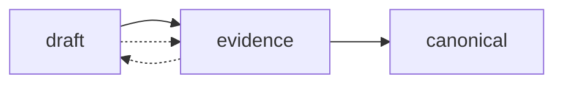
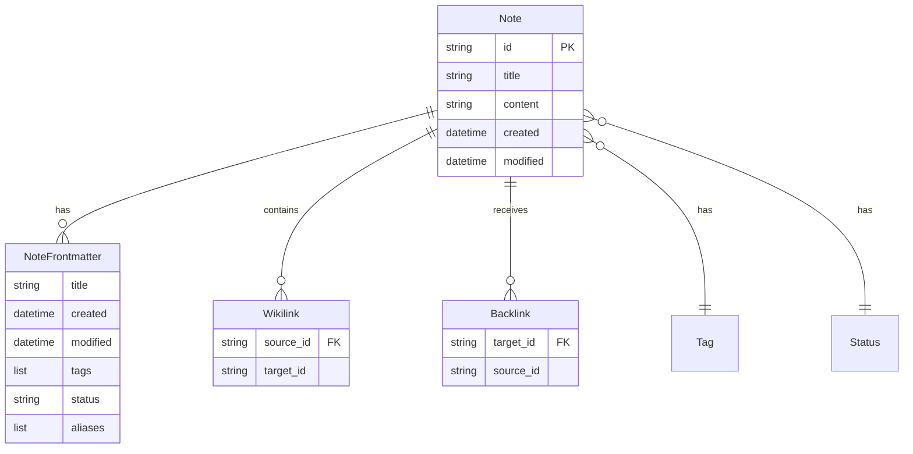

# ADR-004: Note Data Model and Wikilinks

## Status
Accepted

## Date
2024-11-15

## Context

Grafyn needs a data model for storing and managing knowledge that:

1. **Supports Obsidian compatibility**: Use standard Markdown with YAML frontmatter
2. **Enables semantic search**: Store content and metadata for embeddings
3. **Supports knowledge graph**: Track wikilinks and relationships
4. **Maintains metadata**: Track creation/modification dates, tags, status
5. **Allows flexible content**: Support various note types and workflows

The data model must balance simplicity with extensibility.

## Decision

We adopted a **Markdown-based note model** with YAML frontmatter and wikilink support.

### Note Structure

#### File Format

Notes are stored as Markdown files in the `vault/` directory:

```markdown
---
title: Example Note
created: 2024-12-17T00:00:00
modified: 2024-12-17T00:00:00
tags:
  - example
  - documentation
status: canonical
aliases:
  - Sample Note
---

# Example Note

This is the content of the note. You can use [[wikilinks]] to link
to other notes like [[Welcome]].
```

#### Pydantic Models

**File:** `backend/app/models/note.py`

```python
class NoteFrontmatter(BaseModel):
    title: Optional[str] = None
    created: Optional[datetime] = None
    modified: Optional[datetime] = None
    tags: List[str] = []
    status: str = "draft"
    aliases: List[str] = []

class Note(BaseModel):
    id: str                              # Filename without .md
    title: str                           # Display title
    content: str                         # Markdown body
    frontmatter: NoteFrontmatter         # YAML metadata
    outgoing_links: List[str] = []       # [[wikilinks]] targets
    backlinks: List[str] = []          # Notes linking to this

class NoteCreate(BaseModel):
    title: str
    content: str
    tags: List[str] = []
    status: str = "draft"

class NoteUpdate(BaseModel):
    title: Optional[str] = None
    content: Optional[str] = None
    tags: Optional[List[str]] = None
    status: Optional[str] = None

class NoteListItem(BaseModel):
    id: str
    title: str
    status: str
    tags: List[str]
    created: Optional[datetime] = None
    modified: Optional[datetime] = None
    link_count: int = 0
```

### Status Workflow



**Status Definitions:**

| Status | Description | Use Case |
|--------|-------------|----------|
| `draft` | Proposed content awaiting review | New notes, work-in-progress |
| `evidence` | Ingested content from external sources | Chat transcripts, imports |
| `canonical` | Verified, authoritative content | Finalized knowledge |

**Workflow:**
1. Create notes as `draft`
2. Ingest chats as `evidence`
3. Review and promote to `canonical`

### Wikilink Format

#### Syntax

```markdown
[[Note Title]]                    # Simple link
[[Note Title|Display Text]]        # Link with custom text
[[Note Title#Section]]            # Link to section (future)
```

#### Parsing Pattern

```python
WIKILINK_PATTERN = re.compile(r'\[\[([^\]|]+)(?:\|[^\]]+)?\]\]')
```

**Examples:**
- `[[Welcome]]` → Matches "Welcome"
- `[[Welcome|Get Started]]` → Matches "Welcome", displays "Get Started"
- `[[API Design#REST]]` → Matches "API Design#REST" (future)

#### Link Resolution

1. **Exact Match**: `[[Welcome]]` → `Welcome.md`
2. **Space/Underscore**: `[[API Design]]` → `API_Design.md`
3. **Case Insensitive**: `[[welcome]]` → `Welcome.md`
4. **Aliases**: Check aliases in frontmatter

### File Naming Convention

**Rules:**
1. Replace spaces with underscores: `My Note` → `My_Note.md`
2. Remove special characters: `Note!` → `Note.md`
3. Use title as ID: Title `My Note` → ID `My_Note`
4. Preserve case: `API Design` → `API_Design.md`

**Examples:**

| Title | ID | Filename |
|-------|----|----------|
| `Welcome` | `Welcome` | `Welcome.md` |
| `API Design` | `API_Design` | `API_Design.md` |
| `My First Note!` | `My_First_Note` | `My_First_Note.md` |

## Consequences

### Positive

- **Obsidian Compatible**: Standard format, easy migration
- **Human Readable**: Markdown is easy to read and edit
- **Git Friendly**: Text files, easy to version control
- **Flexible**: Can add custom frontmatter fields
- **Portable**: No proprietary format, works with any editor
- **Semantic**: Frontmatter provides structured metadata
- **Graph-Native**: Wikilinks enable knowledge graph
- **Extensible**: Easy to add new fields and features

### Negative

- **No Schema Enforcement**: YAML frontmatter is flexible but untyped
- **Manual Consistency**: Must ensure links point to valid notes
- **File System Limits**: Performance issues with thousands of files
- **No Transactions**: File operations aren't atomic
- **Manual Backlinks**: Must compute backlinks from outgoing links
- **Case Sensitivity**: Link resolution can be tricky

### Trade-offs

| Decision | Benefit | Trade-off |
|----------|---------|-----------|
| Markdown vs Database | Human-readable, portable | No ACID, manual consistency |
| YAML Frontmatter vs JSON | More readable, comments | Less strict validation |
| Wikilinks vs Auto-linking | Explicit, controllable | Manual linking required |
| File-based vs Database | Simple, portable | No transactions, scaling limits |

## Alternatives Considered

### Database Storage (PostgreSQL, MongoDB)
**Rejected because:**
- Violates local-first principle
- Requires database server setup
- Less portable than files
- Not Obsidian-compatible
- Overkill for personal use

### JSON Files
**Rejected because:**
- Less human-readable than Markdown
- No standard editor support
- Can't use existing Markdown tools
- No frontmatter standard
- Harder to edit manually

### Custom Binary Format
**Rejected because:**
- Not human-readable
- Requires custom tools
- Not portable
- Lock-in to Grafyn
- Can't use existing editors

### Auto-linking (Keyword-based)
**Rejected because:**
- Less explicit than wikilinks
- Harder to control
- More false positives
- Can't handle disambiguation
- Not Obsidian-compatible

### Hashtags for Links (#tag)
**Rejected because:**
- Ambiguous (tags vs links)
- No directionality
- Can't link to specific notes
- Not Obsidian-compatible
- Limited expressiveness

## Implementation Details

### File I/O

**Using python-frontmatter:**

```python
import frontmatter

def read_note(filepath: str) -> Note:
    post = frontmatter.load(filepath)
    return Note(
        id=Path(filepath).stem,
        title=post.get('title', Path(filepath).stem),
        content=post.content,
        frontmatter=NoteFrontmatter(**post.metadata),
        outgoing_links=extract_wikilinks(post.content)
    )

def write_note(filepath: str, note: Note) -> None:
    post = frontmatter.Post(
        note.content,
        **note.frontmatter.dict(exclude_unset=True)
    )
    frontmatter.dump(post, filepath)
```

### Wikilink Extraction

```python
def extract_wikilinks(content: str) -> List[str]:
    matches = WIKILINK_PATTERN.findall(content)
    return [m.strip() for m in matches]
```

### Backlink Computation

```python
def get_backlinks(note_id: str) -> List[str]:
    backlinks = []
    for note in list_notes():
        if note_id in [normalize(l) for l in note.outgoing_links]:
            backlinks.append(note.id)
    return backlinks
```

### ID Generation

```python
def generate_id(title: str) -> str:
    # Replace spaces with underscores
    id = title.replace(" ", "_")
    # Remove special characters
    id = re.sub(r'[^\w\s-]', '', id)
    return id
```

## Data Model Relationships



## Validation Rules

### Required Fields
- `id`: Always present (derived from filename)
- `title`: Required for `NoteCreate`
- `content`: Required for `NoteCreate`

### Optional Fields
- `created`: Auto-generated if not provided
- `modified`: Auto-updated on save
- `tags`: Empty list if not provided
- `status`: Defaults to "draft"
- `aliases`: Empty list if not provided

### Validation
```python
class NoteCreate(BaseModel):
    title: str = Field(..., min_length=1, max_length=200)
    content: str = Field(..., min_length=0)
    tags: List[str] = Field(default_factory=list, max_items=20)
    status: str = Field(default="draft", regex="^(draft|evidence|canonical)$")
```

## Migration Strategy

### From Obsidian
1. Copy `.md` files to `vault/` directory
2. Run `POST /api/notes/reindex` to build search index
3. Run `POST /api/graph/rebuild` to build graph index
4. Review and update frontmatter as needed

### From Other Formats
1. Convert to Markdown with YAML frontmatter
2. Import via `POST /api/notes` or bulk import script
3. Reindex for search and graph

### Version Control
- Notes are plain text files
- Git can track all changes
- Merge conflicts are human-readable
- Easy to revert changes

## Future Enhancements

### Planned Features

1. **Section Links**: Support `[[Note#Section]]` syntax
2. **Embeds**: Embed note content: `![[Note]]`
3. **Transclusions**: Include note content inline
4. **Custom Properties**: Extensible frontmatter schema
5. **Note Templates**: Predefined frontmatter structures
6. **Note Versioning**: Track note history

### Potential New Fields

```python
class NoteFrontmatter(BaseModel):
    # Existing fields...
    author: Optional[str] = None          # Note author
    category: Optional[str] = None         # Category classification
    priority: Optional[int] = None        # Priority (1-5)
    due_date: Optional[datetime] = None  # Due date for tasks
    checklist: Optional[List[Dict]] = None # Task checklists
    references: Optional[List[str]] = None # External references
```

## References

- [Obsidian Documentation](https://help.obsidian.md/)
- [YAML Frontmatter](https://jekyllrb.com/docs/front-matter/)
- [Data Models - Backend](../../docs/data-models-backend.md)
- [Project History](../01-project-context/history.md)
- [ADR-001: Technology Stack](./adr-001-technology-stack.md)

## Related Decisions

- [ADR-001: Technology Stack](./adr-001-technology-stack.md) - Underlying storage format
- [ADR-002: Architecture Pattern](./adr-002-architecture-pattern.md) - How data model is used
- [ADR-005: Embedding Model](./adr-005-embedding-model.md) - How content is embedded

---

**Status:** This decision is active and defines the core data model.
