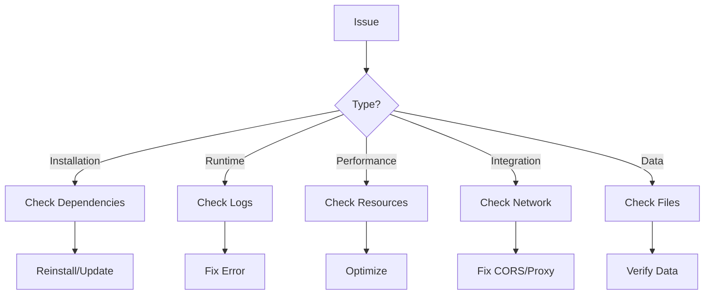

# Troubleshooting Guide

> **Purpose:** Common issues and solutions for OrgAI setup and development
> **Created:** 2025-12-31
> **Status:** Active

## Overview

This guide provides solutions to common issues encountered when setting up and developing with OrgAI.

## Quick Diagnosis

### Issue Categories

1. **Installation Issues**: Setup and dependency problems
2. **Runtime Issues**: Errors during execution
3. **Performance Issues**: Slow operations or high resource usage
4. **Integration Issues**: Backend-frontend communication problems
5. **Data Issues**: Note storage and retrieval problems

### Diagnostic Flow



## Installation Issues

### Backend Won't Start

**Symptoms:**
- Command fails immediately
- Module import errors
- Python version errors

**Diagnosis:**
```bash
# Check Python version
python --version  # Should be 3.10+

# Check virtual environment
which python  # Should point to venv

# Check dependencies
pip list | grep fastapi
pip list | grep lancedb
```

**Solutions:**

1. **Wrong Python Version**
```bash
# Install correct Python version
# Using pyenv
pyenv install 3.10
pyenv global 3.10

# Using conda
conda create -n orgai python=3.10
conda activate orgai
```

2. **Virtual Environment Not Activated**
```bash
# Activate virtual environment
cd backend
source venv/bin/activate  # Linux/Mac
venv\Scripts\activate  # Windows

# Verify
which python  # Should show venv path
```

3. **Missing Dependencies**
```bash
# Reinstall all dependencies
pip install -r requirements.txt

# Install development dependencies
pip install -r requirements-dev.txt
```

### Frontend Won't Start

**Symptoms:**
- npm install fails
- Dev server errors
- Module not found errors

**Diagnosis:**
```bash
# Check Node.js version
node --version  # Should be 18+

# Check npm version
npm --version

# Check for lockfile conflicts
ls -la package-lock.json
```

**Solutions:**

1. **Node.js Version Too Old**
```bash
# Update Node.js using nvm
nvm install 20
nvm use 20

# Verify
node --version
```

2. **Dependency Conflicts**
```bash
# Clear cache and reinstall
npm cache clean --force
rm -rf node_modules package-lock.json
npm install
```

3. **Port Already in Use**
```bash
# Find process using port 5173
lsof -i :5173  # Linux/Mac
netstat -ano | findstr :5173  # Windows

# Kill process
kill -9 <PID>  # Linux/Mac
taskkill /PID <PID> /F  # Windows

# Or use different port
npm run dev -- --port 5174
```

## Runtime Issues

### Backend Returns 500 Errors

**Symptoms:**
- API endpoints return 500
- Internal server error messages
- Stack traces in logs

**Diagnosis:**
```bash
# Check backend logs
tail -f backend.log

# Look for:
# - Exception stack traces
# - Missing files
# - Database errors
```

**Solutions:**

1. **Missing Directories**
```bash
# Create required directories
mkdir -p ../vault ../data

# Verify permissions
ls -la ../vault ../data
```

2. **Database Connection Error**
```bash
# Check data directory
ls -la ../data

# Rebuild LanceDB index
rm -rf ../data/lancedb
curl -X POST http://localhost:8080/api/notes/reindex
```

3. **Service Initialization Error**
```bash
# Check embedding model download
ls -la ~/.cache/torch/sentence_transformers/

# Manually download if needed
python -c "from sentence_transformers import SentenceTransformer; SentenceTransformer('all-MiniLM-L6-v2')"
```

### Frontend API Calls Fail

**Symptoms:**
- Network errors in console
- CORS errors
- Timeout errors

**Diagnosis:**
```javascript
// Check browser console for errors
// Network tab shows failed requests
// Look for:
// - CORS errors
// - 404/500 status codes
// - Timeout errors
```

**Solutions:**

1. **CORS Error**
```bash
# Check backend CORS configuration
# In backend/app/main.py
app.add_middleware(
    CORSMiddleware,
    allow_origins=["http://localhost:5173"],  # Add frontend URL
    allow_credentials=True,
    allow_methods=["*"],
    allow_headers=["*"],
)
```

2. **Backend Not Running**
```bash
# Check if backend is running
curl http://localhost:8080/health

# If not running, start it
cd backend
uvicorn app.main:app --reload
```

3. **Proxy Configuration**
```javascript
// Check vite.config.js proxy settings
server: {
  proxy: {
    '/api': {
      target: 'http://localhost:8080',
      changeOrigin: true,
    },
  },
}
```

## Performance Issues

### Slow Search Performance

**Symptoms:**
- Search takes > 2 seconds
- UI freezes during search
- High CPU usage

**Diagnosis:**
```bash
# Check system resources
top  # Linux/Mac
tasklist  # Windows

# Check note count
ls ../vault | wc -l

# Check index size
du -sh ../data
```

**Solutions:**

1. **Rebuild Index**
```bash
# Rebuild search index
curl -X POST http://localhost:8080/api/notes/reindex

# Rebuild graph index
curl -X POST http://localhost:8080/api/graph/rebuild
```

2. **Optimize LanceDB**
```python
# In vector_search.py
table.create_index(
    metric="cosine",
    num_partitions=256,
    num_sub_vectors=16
)
```

3. **Implement Pagination**
```bash
# Limit results per page
curl "http://localhost:8080/api/notes?limit=20&offset=0"
```

### High Memory Usage

**Symptoms:**
- Backend uses > 1GB memory
- System becomes slow
- OOM errors

**Diagnosis:**
```bash
# Check memory usage
ps aux | grep python
top

# Check for memory leaks
valgrind --leak-check=full python app/main.py
```

**Solutions:**

1. **Clear Caches**
```python
# In services
def clear_cache():
    knowledge_store._cache.clear()
    graph_index._outgoing.clear()
    graph_index._incoming.clear()
```

2. **Lazy Loading**
```python
# Load notes on demand instead of all at once
def get_notes_paginated(offset: int = 0, limit: int = 50):
    notes = list(vault_path.glob("*.md"))[offset:offset+limit]
    return [load_note(n) for n in notes]
```

3. **Reduce Batch Size**
```python
# Process in smaller batches
BATCH_SIZE = 50  # Instead of 100
for i in range(0, len(notes), BATCH_SIZE):
    batch = notes[i:i+BATCH_SIZE]
    process_batch(batch)
```

## Integration Issues

### MCP Tools Not Available

**Symptoms:**
- Claude Desktop doesn't show OrgAI tools
- MCP connection fails
- Tools appear but don't work

**Diagnosis:**
```bash
# Check MCP endpoint
curl http://localhost:8080/mcp

# Check Claude Desktop config
cat ~/.config/Claude/claude_desktop_config.json

# Check Claude Desktop logs
# Location: ~/Library/Logs/Claude/
```

**Solutions:**

1. **Backend Not Running**
```bash
# Start backend
cd backend
uvicorn app.main:app --reload

# Verify MCP endpoint
curl http://localhost:8080/mcp
```

2. **Incorrect Configuration**
```json
// Check Claude Desktop config
{
  "mcpServers": {
    "orgai": {
      "url": "http://localhost:8080/mcp",
      "transport": "sse"
    }
  }
}
```

3. **Restart Claude Desktop**
```bash
# Stop Claude Desktop
# Start Claude Desktop
# MCP tools should appear after restart
```

### Wikilinks Not Resolving

**Symptoms:**
- Backlinks don't appear
- Wikilinks show as broken
- Graph shows no connections

**Diagnosis:**
```bash
# Check graph index
curl http://localhost:8080/api/graph/stats

# Check note titles
ls ../vault

# Check wikilink syntax
# Should be: [[Note Title]] or [[Note Title|Display]]
```

**Solutions:**

1. **Rebuild Graph Index**
```bash
# Rebuild graph
curl -X POST http://localhost:8080/api/graph/rebuild
```

2. **Check Wikilink Syntax**
```markdown
# Correct
[[Note Title]]
[[Note Title|Display Text]]

# Incorrect
[Note Title]
[[Note Title]]  # Extra space
```

3. **Case Sensitivity**
```bash
# Note titles are case-sensitive
# [[API Design]] ≠ [[api design]]

# Use consistent casing
```

## Data Issues

### Notes Not Appearing

**Symptoms:**
- Created notes don't show in list
- Search doesn't find notes
- Frontend shows empty list

**Diagnosis:**
```bash
# Check vault directory
ls -la ../vault

# Check file permissions
stat ../vault/Note.md

# Check file format
file ../vault/Note.md
```

**Solutions:**

1. **File Extension**
```bash
# Ensure files have .md extension
mv Note Note.md

# Verify
ls ../vault/*.md
```

2. **Frontmatter Format**
```markdown
# Correct YAML frontmatter
---
title: Note Title
created: 2024-12-17
tags:
  - tag1
  - tag2
---

# Incorrect (missing dashes)
title: Note Title
created: 2024-12-17
tags:
  - tag1
```

3. **Refresh Frontend**
```javascript
// Force refresh
location.reload()

// Clear cache
localStorage.clear()
```

### Duplicate Notes

**Symptoms:**
- Multiple notes with same title
- Confusion in search results
- Backlinks pointing to wrong notes

**Diagnosis:**
```bash
# Check for duplicate filenames
ls ../vault | sort | uniq -d

# Check for similar titles
ls ../vault | grep -i "note"
```

**Solutions:**

1. **Merge Notes**
```bash
# Manually merge duplicate notes
# Keep content from both
# Update wikilinks to point to merged note
```

2. **Delete Duplicates**
```bash
# Identify duplicates
ls ../vault | sort | uniq -d

# Delete older duplicates
rm ../vault/Old_Note.md
```

## Getting Help

### Information to Provide

When asking for help, provide:

1. **OS and Version**
   ```bash
   uname -a  # Linux/Mac
   systeminfo  # Windows
   python --version
   node --version
   ```

2. **Error Messages**
   - Full error message
   - Stack trace
   - Browser console errors

3. **Steps to Reproduce**
   - What you were doing
   - Expected behavior
   - Actual behavior

4. **Configuration**
   - .env file contents (sanitized)
   - vite.config.js settings
   - Any custom changes

### Where to Get Help

1. **Documentation**: Check [`docs/`](../../docs/) directory
2. **Issues**: Search existing GitHub issues
3. **New Issue**: Create new issue with details
4. **Community**: Ask in discussions or chat

## Prevention Checklist

### Before Starting Development

- [ ] Read project documentation
- [ ] Follow setup guide exactly
- [ ] Use correct software versions
- [ ] Configure environment variables
- [ ] Create required directories
- [ ] Verify installation with tests

### During Development

- [ ] Check logs for errors
- [ ] Test changes incrementally
- [ ] Run tests before committing
- [ ] Review code for issues
- [ ] Document non-obvious changes

### Before Deployment

- [ ] All tests pass
- [ ] No console errors
- [ ] Performance is acceptable
- [ ] Security is configured
- [ ] Documentation is updated

## Related Documentation

- [Environment Variables](./environment-variables.md)
- [Setup Guide](./setup-guide.md)
- [Backend Issues](../04-known-issues/backend-issues.md)
- [Frontend Issues](../04-known-issues/frontend-issues.md)

---

**See Also:**
- [Development Guide - Backend](../../docs/development-guide-backend.md)
- [Development Guide - Frontend](../../docs/development-guide-frontend.md)
- [IMPROVEMENTS.md](../../docs/IMPROVEMENTS.md)
