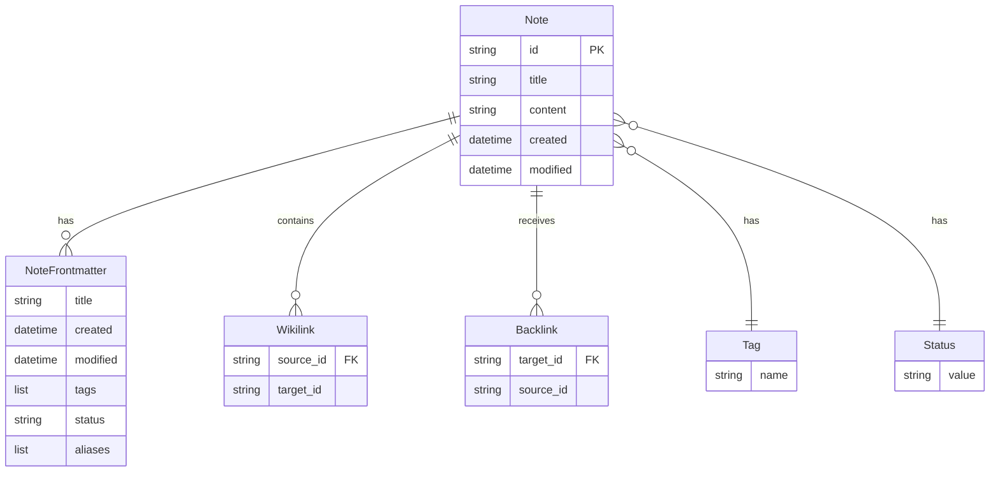

# Data Models Quick Reference

> **Purpose:** Concise reference for all OrgAI data models
> **Created:** 2025-12-31
> **Status:** Active

## Overview

Quick reference for all Pydantic models used in OrgAI backend.

## Core Models

### Note

**Purpose:** Full note representation with all metadata

**Fields:**
| Field | Type | Required | Description |
|--------|------|----------|-------------|
| `id` | string | Yes | Note ID (filename without .md) |
| `title` | string | Yes | Display title |
| `content` | string | Yes | Markdown body |
| `frontmatter` | NoteFrontmatter | Yes | YAML metadata |
| `outgoing_links` | List[str] | No | [[wikilinks]] targets |
| `backlinks` | List[str] | No | Notes linking to this |

**Example:**
```json
{
  "id": "Welcome",
  "title": "Welcome",
  "content": "# Welcome to OrgAI\n\nThis is your knowledge base...",
  "frontmatter": {
    "title": "Welcome",
    "created": "2024-12-17T00:00:00",
    "modified": "2024-12-17T00:00:00",
    "tags": ["welcome", "getting-started"],
    "status": "draft",
    "aliases": []
  },
  "outgoing_links": ["Example Note", "Wikilinks"],
  "backlinks": ["Example Note"]
}
```

---

### NoteFrontmatter

**Purpose:** YAML frontmatter metadata

**Fields:**
| Field | Type | Required | Default | Description |
|--------|------|----------|---------|-------------|
| `title` | string | No | None | Note title |
| `created` | datetime | No | None | Creation date |
| `modified` | datetime | No | None | Last modified date |
| `tags` | List[str] | No | [] | Searchable tags |
| `status` | string | No | "draft" | Note status |
| `aliases` | List[str] | No | [] | Alternative titles |

**Status Values:**
- `draft`: Proposed content awaiting review
- `evidence`: Ingested content (e.g., chat transcripts)
- `canonical`: Verified, authoritative content

**Example:**
```json
{
  "title": "Welcome",
  "created": "2024-12-17T00:00:00",
  "modified": "2024-12-17T00:00:00",
  "tags": ["welcome", "getting-started"],
  "status": "draft",
  "aliases": []
}
```

---

### NoteCreate

**Purpose:** Schema for creating new notes

**Fields:**
| Field | Type | Required | Default | Description |
|--------|------|----------|---------|-------------|
| `title` | string | Yes | - | Note title (generates file ID) |
| `content` | string | Yes | - | Markdown body |
| `tags` | List[str] | No | [] | Optional tags |
| `status` | string | No | "draft" | Initial status |

**Validation:**
- `title`: 1-200 characters
- `content`: 0+ characters
- `tags`: 0-20 items, each 1-50 chars
- `status`: Must be `draft`, `evidence`, or `canonical`

**Example:**
```json
{
  "title": "My New Note",
  "content": "# My New Note\n\nContent goes here...",
  "tags": ["example"],
  "status": "draft"
}
```

---

### NoteUpdate

**Purpose:** Schema for updating notes

**Fields:**
| Field | Type | Required | Description |
|--------|------|----------|-------------|
| `title` | string | No | New title (optional) |
| `content` | string | No | New content (optional) |
| `tags` | List[str] | No | New tags (optional) |
| `status` | string | No | New status (optional) |

**Note:** All fields are optional - only provided fields are updated.

**Validation:**
- `title`: 1-200 characters (if provided)
- `content`: 0+ characters (if provided)
- `tags`: 0-20 items, each 1-50 chars (if provided)
- `status`: Must be `draft`, `evidence`, or `canonical` (if provided)

**Example:**
```json
{
  "title": "Updated Title",
  "content": "Updated content...",
  "tags": ["updated"],
  "status": "canonical"
}
```

---

### NoteListItem

**Purpose:** Lightweight note for list responses

**Fields:**
| Field | Type | Required | Description |
|--------|------|----------|-------------|
| `id` | string | Yes | Note ID |
| `title` | string | Yes | Display title |
| `status` | string | Yes | Current status |
| `tags` | List[str] | Yes | All tags |
| `created` | datetime | No | Creation date |
| `modified` | datetime | No | Last modified |
| `link_count` | integer | No | Number of outgoing [[wikilinks]] |

**Example:**
```json
{
  "id": "Welcome",
  "title": "Welcome",
  "status": "draft",
  "tags": ["welcome", "getting-started"],
  "created": "2024-12-17T00:00:00",
  "modified": "2024-12-17T00:00:00",
  "link_count": 2
}
```

---

### SearchResult

**Purpose:** Search result with relevance score

**Fields:**
| Field | Type | Required | Description |
|--------|------|----------|-------------|
| `note_id` | string | Yes | Note ID |
| `title` | string | Yes | Note title |
| `snippet` | string | Yes | Excerpt around match |
| `score` | float | Yes | Similarity (0-1) |
| `tags` | List[str] | No | Note tags |

**Score Interpretation:**
- `1.0`: Exact lexical match
- `0.8+`: Very similar semantically
- `0.5-0.8`: Related content
- `<0.5`: Weak match

**Example:**
```json
{
  "note_id": "Welcome",
  "title": "Welcome",
  "snippet": "...your knowledge base. Create notes, link them together...",
  "score": 0.87,
  "tags": ["welcome", "getting-started"]
}
```

---

### BacklinkInfo

**Purpose:** Information about a backlink with context

**Fields:**
| Field | Type | Required | Description |
|--------|------|----------|-------------|
| `source_id` | string | Yes | ID of note containing the link |
| `source_title` | string | Yes | Title of source note |
| `context` | string | Yes | Text surrounding the [[link]] |

**Context:** ±100 characters around the wikilink.

**Example:**
```json
{
  "source_id": "Example_Note",
  "source_title": "Example Note",
  "context": "...link to other notes using wikilinks like [[Welcome]]. The system will..."
}
```

## Vector Storage Schema

### NoteEmbedding (LanceDB)

**Purpose:** Schema for storing note embeddings in LanceDB

**Fields:**
| Field | Type | Required | Description |
|--------|------|----------|-------------|
| `note_id` | string | Yes | Note ID (primary key) |
| `title` | string | Yes | Note title |
| `text` | string | Yes | First 1000 chars for snippet |
| `vector` | Vector(384) | Yes | all-MiniLM-L6-v2 embedding |

**Vector Details:**
- **Dimension:** 384 (fixed by model)
- **Model:** `sentence-transformers/all-MiniLM-L6-v2`
- **Input:** Concatenated `{title}\n\n{content}`

**Example:**
```json
{
  "note_id": "Welcome",
  "title": "Welcome",
  "text": "# Welcome to OrgAI\n\nThis is your knowledge base...",
  "vector": [0.123, -0.456, ..., 0.789]  // 384 values
}
```

## Model Relationships



## File Storage Format

### Markdown File Structure

```markdown
---
title: Example Note
created: 2024-12-17
modified: 2024-12-17
tags:
  - example
  - documentation
status: canonical
aliases:
  - Sample Note
---

# Example Note

This is the content of the note. You can use [[wikilinks]] to link
to other notes like [[Welcome]].
```

### Wikilink Syntax

| Syntax | Example | Description |
|--------|---------|-------------|
| `[[Note Title]]` | `[[Welcome]]` | Simple link |
| `[[Note Title|Display]]` | `[[Welcome|Get Started]]` | Link with custom text |
| `[[Note Title#Section]]` | `[[Welcome#Getting Started]]` | Link to section (future) |

### ID Generation

**Rules:**
1. Replace spaces with underscores: `My Note` → `My_Note`
2. Remove special characters: `Note!` → `Note`
3. Use title as ID: Title `My Note` → ID `My_Note`
4. Preserve case: `API Design` → `API_Design`

## Validation Rules

### Required Fields

| Model | Required Fields |
|-------|----------------|
| `Note` | `id`, `title`, `content`, `frontmatter` |
| `NoteCreate` | `title`, `content` |
| `NoteUpdate` | None (all optional) |
| `NoteListItem` | `id`, `title`, `status`, `tags` |
| `SearchResult` | `note_id`, `title`, `snippet`, `score` |
| `BacklinkInfo` | `source_id`, `source_title`, `context` |

### Optional Fields

| Model | Optional Fields | Default |
|-------|----------------|---------|
| `NoteFrontmatter` | All | `title`: None, `created`: None, `modified`: None, `tags`: [], `status`: "draft", `aliases`: [] |
| `NoteCreate` | `tags`, `status` | `tags`: [], `status`: "draft" |
| `NoteUpdate` | All | None |
| `NoteListItem` | `created`, `modified`, `link_count` | `created`: None, `modified`: None, `link_count`: 0 |
| `SearchResult` | `tags` | `tags`: [] |

### Field Constraints

| Field | Constraint | Description |
|--------|------------|-------------|
| `title` | 1-200 chars | Note title length |
| `content` | 0+ chars | No minimum, unlimited max |
| `tags` | 0-20 items | Maximum number of tags |
| `tags[i]` | 1-50 chars | Individual tag length |
| `status` | Enum | Must be `draft`, `evidence`, or `canonical` |
| `vector` | 384 dims | Fixed by embedding model |
| `context` | ±100 chars | Backlink context length |

## Usage Examples

### Creating Notes

```python
from app.models.note import NoteCreate

note_data = NoteCreate(
    title="My New Note",
    content="# My New Note\n\nContent here...",
    tags=["example"],
    status="draft"
)

note = knowledge_store.create_note(note_data)
```

### Updating Notes

```python
from app.models.note import NoteUpdate

update_data = NoteUpdate(
    title="Updated Title",
    status="canonical"
)

note = knowledge_store.update_note(note_id, update_data)
```

### Processing Search Results

```python
results = vector_search.search("REST API design")

for result in results:
    print(f"Note: {result.title}")
    print(f"Score: {result.score}")
    print(f"Relevance: {get_relevance_label(result.score)}")
```

### Processing Backlinks

```python
backlinks = graph_index.get_backlinks_with_context(note_id)

for backlink in backlinks:
    print(f"From: {backlink.source_title}")
    print(f"Context: {backlink.context}")
```

## Related Documentation

- [API Contracts - Backend](../../docs/api-contracts-backend.md)
- [Data Models - Backend](../../docs/data-models-backend.md)
- [Services](./services.md)
- [API Endpoints](./api-endpoints.md)

---

**See Also:**
- [Architecture - Backend](../../docs/architecture-backend.md)
- [ADR-004: Data Model](../02-architecture-decisions/adr-004-data-model.md)
- [Backend Patterns](../03-development-patterns/backend-patterns.md)
