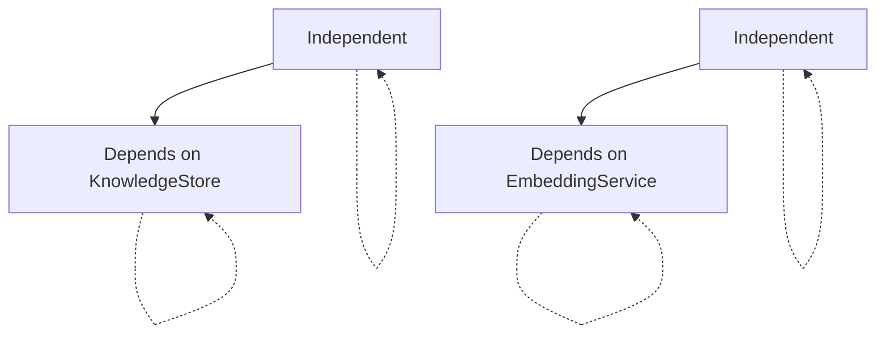

# Services Quick Reference

> **Purpose:** Concise reference for all OrgAI backend services
> **Created:** 2025-12-31
> **Status:** Active

## Overview

Quick reference for all 4 backend services in OrgAI.

## Service Summary

| Service | Purpose | Dependencies |
|----------|---------|--------------|
| KnowledgeStore | Markdown note CRUD with YAML frontmatter | None |
| VectorSearchService | LanceDB-backed semantic search | EmbeddingService |
| GraphIndexService | Wikilink parsing and backlink tracking | KnowledgeStore |
| EmbeddingService | Text to vector encoding | sentence-transformers |

## KnowledgeStore Service

**File:** `backend/app/services/knowledge_store.py`

**Purpose:** CRUD operations for Markdown notes with YAML frontmatter

### Key Methods

| Method | Parameters | Returns | Description |
|---------|------------|--------|-------------|
| `list_notes()` | - | `List[NoteListItem]` | List all notes |
| `get_note(id)` | `id: str` | `Note` | Get full note content |
| `create_note(data)` | `data: NoteCreate` | `Note` | Create new note |
| `update_note(id, data)` | `id: str, data: NoteUpdate` | `Note` | Update existing note |
| `delete_note(id)` | `id: str` | `None` | Delete note |
| `extract_wikilinks(content)` | `content: str` | `List[str]` | Parse `[[wikilinks]]` |
| `get_all_content()` | - | `List[Tuple[str, str, str]]` | Get all notes for indexing |

### Wikilink Pattern

```python
WIKILINK_PATTERN = re.compile(r'\[\[([^\]|]+)(?:\|[^\]]+)?\]\]')
```

**Examples:**
- `[[Welcome]]` → Matches "Welcome"
- `[[Welcome|Get Started]]` → Matches "Welcome"
- `[[Note 1]] and [[Note 2]]` → Matches "Note 1", "Note 2"

### Usage

```python
from app.services.knowledge_store import KnowledgeStore

store = KnowledgeStore("../vault")

# List notes
notes = store.list_notes()

# Get note
note = store.get_note("Welcome")

# Create note
new_note = store.create_note(NoteCreate(
    title="My Note",
    content="Content"
))

# Update note
updated = store.update_note("My_Note", NoteUpdate(
    content="Updated content"
))

# Delete note
store.delete_note("My_Note")

# Extract wikilinks
links = store.extract_wikilinks("Link to [[Other Note]]")
# Returns: ["Other Note"]
```

---

## VectorSearchService Service

**File:** `backend/app/services/vector_search.py`

**Purpose:** LanceDB-backed semantic search

### Key Methods

| Method | Parameters | Returns | Description |
|---------|------------|--------|-------------|
| `index_note(id, title, content)` | `id: str, title: str, content: str` | `None` | Index single note |
| `index_all(notes)` | `notes: List[Tuple]` | `None` | Batch index all notes |
| `search(query, limit)` | `query: str, limit: int` | `List[SearchResult]` | Semantic similarity search |
| `delete_note(id)` | `id: str` | `None` | Remove from index |

### LanceDB Schema

```python
class NoteEmbedding(LanceModel):
    note_id: str
    title: str
    text: str
    vector: Vector(384)  # all-MiniLM-L6-v2 dimension
```

### Usage

```python
from app.services.vector_search import VectorSearchService

service = VectorSearchService("../data", embedding_service)

# Index single note
service.index_note("Welcome", "Welcome", "Content...")

# Index all notes
notes = [("Welcome", "Welcome", "Content..."), ...]
service.index_all(notes)

# Search
results = service.search("REST API design", limit=10)
# Returns: List[SearchResult]

# Delete from index
service.delete_note("Welcome")
```

---

## GraphIndexService Service

**File:** `backend/app/services/graph_index.py`

**Purpose:** Wikilink parsing and backlink tracking

### Key Methods

| Method | Parameters | Returns | Description |
|---------|------------|--------|-------------|
| `build_index()` | - | `None` | Rebuild full graph from all notes |
| `get_outgoing_links(id)` | `id: str` | `List[str]` | Get notes this note links to |
| `get_backlinks(id)` | `id: str` | `List[str]` | Get notes linking to this note |
| `get_backlinks_with_context(id)` | `id: str` | `List[BacklinkInfo]` | Backlinks with context |
| `get_neighbors(id, depth)` | `id: str, depth: int` | `Dict[str, List[str]]` | BFS traversal |
| `find_unlinked_mentions(id)` | `id: str` | `List[Dict]` | Find potential links |
| `update_note(id, old, new)` | `id: str, old: str, new: str` | `None` | Incremental graph update |

### Data Structures

```python
self._outgoing: Dict[str, Set[str]]  # note_id → linked note IDs
self._incoming: Dict[str, Set[str]]  # note_id → notes linking to it
```

### Usage

```python
from app.services.graph_index import GraphIndexService

graph = GraphIndexService(knowledge_store)

# Build index
graph.build_index()

# Get outgoing links
outgoing = graph.get_outgoing_links("Welcome")
# Returns: ["Example Note", "Wikilinks"]

# Get backlinks
backlinks = graph.get_backlinks("Welcome")
# Returns: ["Example Note"]

# Get backlinks with context
backlinks_with_context = graph.get_backlinks_with_context("Welcome")
# Returns: List[BacklinkInfo]

# Get neighbors (graph visualization)
neighbors = graph.get_neighbors("Welcome", depth=2)
# Returns: {"Welcome": ["A", "B"], "A": ["Welcome", "C"], "B": ["Welcome"]}

# Find unlinked mentions
mentions = graph.find_unlinked_mentions("Welcome")
# Returns: [{"note_id": "X", "title": "X Note"}]

# Update graph (after note change)
graph.update_note("Welcome", old_content, new_content)
```

---

## EmbeddingService Service

**File:** `backend/app/services/embedding.py`

**Purpose:** Text to vector encoding using sentence-transformers

### Key Methods

| Method | Parameters | Returns | Description |
|---------|------------|--------|-------------|
| `encode(text)` | `text: str` | `np.ndarray` | Single text → vector |
| `encode_batch(texts)` | `texts: List[str]` | `List[np.ndarray]` | Batch encoding |
| `dimension` | - | `int` | Returns 384 (model output size) |

### Model Details

| Property | Value |
|----------|-------|
| **Model Name** | `all-MiniLM-L6-v2` |
| **Framework** | sentence-transformers |
| **Dimensions** | 384 |
| **Max Sequence Length** | 512 tokens |
| **Model Size** | ~120 MB |

### Usage

```python
from app.services.embedding import EmbeddingService

service = EmbeddingService("all-MiniLM-L6-v2")

# Encode single text
vector = service.encode("REST API design")
# Returns: np.ndarray([0.123, -0.456, ..., 0.789])  # 384 values

# Encode batch
texts = ["Text 1", "Text 2", "Text 3"]
vectors = service.encode_batch(texts)
# Returns: List[np.ndarray]

# Get dimension
dim = service.dimension
# Returns: 384
```

## Service Dependencies



## Service Initialization

```python
# In main.py
from app.services import (
    KnowledgeStore,
    VectorSearchService,
    GraphIndexService,
    EmbeddingService
)
from app.config import get_settings

settings = get_settings()

# Initialize services
knowledge_store = KnowledgeStore(settings.vault_path)
embedding_service = EmbeddingService(settings.embedding_model)
vector_search = VectorSearchService(settings.data_path, embedding_service)
graph_index = GraphIndexService(knowledge_store)

# Dependency injection
app.dependency_overrides[KnowledgeStore] = lambda: knowledge_store
app.dependency_overrides[VectorSearchService] = lambda: vector_search
app.dependency_overrides[GraphIndexService] = lambda: graph_index
```

## Common Patterns

### Pattern: Lazy Initialization

```python
class EmbeddingService:
    def __init__(self, model_name: str):
        self.model_name = model_name
        self._model = None
    
    @property
    def model(self):
        if self._model is None:
            self._model = SentenceTransformer(self.model_name)
        return self._model
```

### Pattern: Batch Processing

```python
def index_all(self, notes: List[Tuple]) -> None:
    BATCH_SIZE = 100
    
    for i in range(0, len(notes), BATCH_SIZE):
        batch = notes[i:i + BATCH_SIZE]
        self._process_batch(batch)
```

### Pattern: Error Handling

```python
def get_note(self, note_id: str) -> Note:
    try:
        return self._load_note(note_id)
    except FileNotFoundError:
        logger.error(f"Note {note_id} not found")
        raise NoteNotFoundError(f"Note {note_id} not found")
```

## Performance Characteristics

| Operation | Typical Time | Notes |
|-----------|---------------|-------|
| List notes | < 10ms | Depends on file count |
| Get note | < 5ms | File I/O |
| Create note | < 20ms | File write + frontmatter |
| Update note | < 20ms | File write + frontmatter |
| Delete note | < 5ms | File delete |
| Extract wikilinks | < 1ms | Regex parsing |
| Index note | < 50ms | Embedding + LanceDB write |
| Batch index | ~400ms/100 notes | Parallel processing |
| Search | < 100ms | Vector search (1000 notes) |
| Get backlinks | < 10ms | Dictionary lookup |
| Get neighbors | < 50ms | BFS traversal (depth 2) |
| Encode text | ~10ms | Single text encoding |

## Testing Services

### Unit Testing

```python
# tests/unit/test_knowledge_store.py
def test_create_note(tmp_path):
    store = KnowledgeStore(tmp_path)
    note = store.create_note(NoteCreate(...))
    assert note.id == "Test_Note"

def test_extract_wikilinks():
    links = KnowledgeStore.extract_wikilinks("[[A]] and [[B]]")
    assert links == ["A", "B"]
```

### Mocking Services

```python
from unittest.mock import Mock, patch

def test_search_with_mock():
    with patch('app.services.vector_search.EmbeddingService') as mock_embedding:
        mock_service = Mock()
        mock_service.encode.return_value = [0.1, 0.2, 0.3]
        mock_embedding.return_value = mock_service
        
        service = VectorSearchService("/tmp", mock_service)
        results = service.search("test")
        
        mock_service.encode.assert_called_once_with("test")
```

## Related Documentation

- [Architecture - Backend](../../docs/architecture-backend.md)
- [Backend Patterns](../03-development-patterns/backend-patterns.md)
- [Data Models](./data-models.md)
- [API Endpoints](./api-endpoints.md)

---

**See Also:**
- [ADR-002: Architecture Pattern](../02-architecture-decisions/adr-002-architecture-pattern.md)
- [Development Guide - Backend](../../docs/development-guide-backend.md)
- [Testing Patterns](../03-development-patterns/testing-patterns.md)
