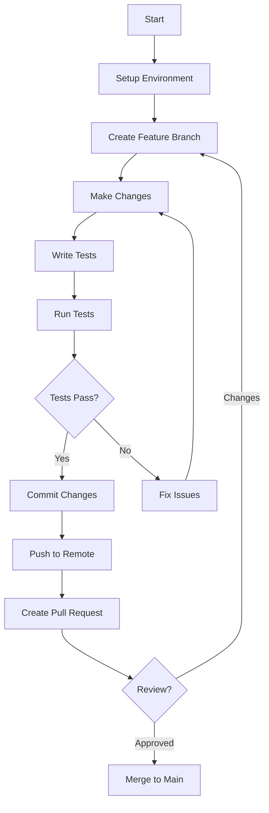

# Development Workflow

> **Purpose:** Define standard development workflow for Grafyn project
> **Created:** 2025-12-31
> **Status:** Active

## Overview

This document defines the standard development workflow for contributing to Grafyn project.

## Development Workflow Diagram



## Prerequisites

### Before Starting

- [ ] Read project documentation
- [ ] Set up development environment
- [ ] Understand coding standards
- [ ] Review architecture decisions
- [ ] Create issue or pick up task

### Environment Setup

```bash
# Backend setup
cd backend
source venv/bin/activate  # Linux/Mac
venv\Scripts\activate  # Windows
pip install -r requirements.txt
pip install -r requirements-dev.txt

# Frontend setup
cd frontend
npm install
```

## Feature Development

### 1. Create Branch

```bash
# Create feature branch from main
git checkout main
git pull origin main
git checkout -b feature/your-feature-name

# Or use fix branch for bugs
git checkout -b fix/issue-number
```

### 2. Implement Feature

#### Backend Development

```bash
# Make changes to backend
cd backend

# Follow coding standards
# - Use type hints
# - Write docstrings
# - Add logging
# - Handle errors

# Test locally
pytest tests/unit/test_service.py -v
```

#### Frontend Development

```bash
# Make changes to frontend
cd frontend

# Follow coding standards
# - Use Composition API
# - Add props/emits
# - Handle loading states
# - Add error handling

# Test locally
npm run dev
```

### 3. Write Tests

#### Backend Tests

```python
# tests/unit/test_feature.py
import pytest
from app.services import YourService

def test_feature_success():
    """Test that feature works as expected."""
    service = YourService()
    result = service.do_something()
    assert result is not None
    assert result.value == expected_value

def test_feature_error_case():
    """Test that feature handles errors correctly."""
    service = YourService()
    with pytest.raises(ValueError):
        service.do_something_invalid()
```

#### Frontend Tests

```javascript
// tests/unit/components/YourComponent.spec.js
import { describe, it, expect } from 'vitest'
import { mount } from '@vue/test-utils'
import YourComponent from '@/components/YourComponent.vue'

describe('YourComponent', () => {
  it('renders correctly', () => {
    const wrapper = mount(YourComponent, {
      props: {
        prop1: 'value'
      }
    })
    
    expect(wrapper.find('.expected-class').exists()).toBe(true)
  })
})
```

### 4. Run Tests

#### Backend Tests

```bash
# Run all tests
cd backend
pytest

# Run with coverage
pytest --cov=app --cov-report=html --cov-report=term-missing

# Run specific test
pytest tests/unit/test_feature.py

# Run with markers
pytest -m unit
pytest -m integration
```

#### Frontend Tests

```bash
# Run all tests
cd frontend
npm test

# Run with coverage
npm run test:coverage

# Run in watch mode
npm run test:watch

# Run specific test
npm test YourComponent.spec.js
```

### 5. Fix Issues

If tests fail:

1. **Identify the issue**
   - Read error message
   - Check stack trace
   - Review test expectations

2. **Fix the code**
   - Make minimal changes
   - Don't break other tests
   - Follow coding standards

3. **Re-run tests**
   - Verify fix works
   - Check for regressions
   - Run full test suite

## Code Review

### Before Submitting

- [ ] All tests pass
- [ ] Code follows standards
- [ ] Documentation updated
- [ ] No console errors
- [ ] No print statements (use logging)
- [ ] No commented-out code
- [ ] No TODO comments (unless intentional)

### Commit Changes

```bash
# Stage changes
git add .

# Review changes
git status
git diff --staged

# Commit with conventional commits
git commit -m "feat: add new feature

- Implement feature X
- Add tests for feature
- Update documentation

Closes #123"
```

### Commit Message Format

```
<type>(<scope>): <subject>

<body>

<footer>
```

**Types:**
- `feat`: New feature
- `fix`: Bug fix
- `docs`: Documentation changes
- `style`: Code style changes
- `refactor`: Code refactoring
- `test`: Adding or updating tests
- `chore`: Maintenance tasks

**Examples:**
```
feat(notes): add note deletion endpoint

Implement DELETE /api/notes/{id} endpoint with proper
error handling and validation.

Closes #42
```

```
fix(search): handle empty query gracefully

Return empty array instead of error when query is empty.

Fixes #15
```

## Pull Request

### Create Pull Request

```bash
# Push to remote
git push origin feature/your-feature-name

# Create pull request via GitHub CLI
gh pr create --title "Add new feature" --body "Description..."

# Or create via GitHub web interface
# Visit: https://github.com/WKJBryan/Grafyn/compare/main...feature/your-feature-name
```

### Pull Request Template

```markdown
## Description
Brief description of changes.

## Type of Change
- [ ] Bug fix
- [ ] New feature
- [ ] Breaking change
- [ ] Documentation update

## Testing
- [ ] Unit tests added/updated
- [ ] Integration tests added/updated
- [ ] All tests pass locally
- [ ] Manual testing completed

## Checklist
- [ ] Code follows project standards
- [ ] Self-review completed
- [ ] No new warnings generated
- [ ] Documentation updated
- [ ] No merge conflicts

## Related Issues
Closes #123
Related to #456
```

## Code Review Process

### For Reviewers

1. **Review the changes**
   - Check for bugs
   - Verify logic correctness
   - Ensure code follows standards
   - Check for security issues

2. **Run tests**
   ```bash
   # Pull changes
   git checkout pr-branch
   
   # Run tests
   pytest
   npm test
   ```

3. **Provide feedback**
   - Be constructive
   - Suggest improvements
   - Ask questions if unclear
   - Approve or request changes

### For Author

1. **Address feedback**
   - Make requested changes
   - Respond to questions
   - Update tests if needed

2. **Re-run tests**
   - Ensure all tests pass
   - Check for regressions

3. **Update PR**
   - Push new commits
   - Mark conversations as resolved

## Integration Workflow

### After Merge

```bash
# Update local main
git checkout main
git pull origin main

# Delete feature branch
git branch -d feature/your-feature-name

# Update dependencies if needed
cd backend && pip install -r requirements.txt
cd frontend && npm install
```

## Daily Development Routine

### Morning

1. **Pull latest changes**
   ```bash
   git checkout main
   git pull origin main
   ```

2. **Review issues/tasks**
   - Check GitHub issues
   - Review project board
   - Pick up new task

3. **Create feature branch**
   ```bash
   git checkout -b feature/task-name
   ```

### During Development

1. **Work incrementally**
   - Make small commits
   - Test frequently
   - Don't break existing functionality

2. **Monitor logs**
   - Check backend logs
   - Check browser console
   - Watch for errors

3. **Run tests regularly**
   - Run unit tests after changes
   - Run integration tests periodically
   - Test frontend manually

### End of Day

1. **Review work**
   - Check what was completed
   - Identify what's in progress
   - Plan next steps

2. **Commit work**
   - Commit completed features
   - Push to remote
   - Create PRs if ready

## Hotfix Workflow

### For Critical Bugs

```bash
# Create hotfix branch from main
git checkout main
git pull origin main
git checkout -b hotfix/critical-bug

# Fix the bug
# ...

# Test thoroughly
pytest
npm test

# Merge to main
git checkout main
git merge hotfix/critical-bug
git push origin main

# Tag release (if needed)
git tag -a v0.1.1 -m "Hotfix for critical bug"
git push origin v0.1.1

# Delete hotfix branch
git branch -d hotfix/critical-bug
```

## Release Workflow

### Pre-Release Checklist

- [ ] All tests pass
- [ ] Documentation updated
- [ ] CHANGELOG updated
- [ ] Version number updated
- [ ] No known issues
- [ ] Performance tested
- [ ] Security reviewed

### Release Process

```bash
# Update version
# Update version in backend/app/main.py
# Update version in frontend/package.json

# Create release commit
git commit -m "chore: bump version to 0.2.0"

# Create tag
git tag -a v0.2.0 -m "Release 0.2.0"

# Push tag
git push origin main --tags
```

### Post-Release

- [ ] Create GitHub release
- [ ] Update documentation
- [ ] Announce to users
- [ ] Monitor for issues

## Best Practices

### Do's

- ✅ Write tests before code
- ✅ Commit frequently with clear messages
- ✅ Keep PRs small and focused
- ✅ Review your own code before submitting
- ✅ Respond to review feedback promptly
- ✅ Update documentation with code changes
- ✅ Run full test suite before PR

### Don'ts

- ❌ Don't commit directly to main
- ❌ Don't skip writing tests
- ❌ Don't ignore review feedback
- ❌ Don't make huge PRs
- ❌ Don't commit broken code
- ❌ Don't leave TODO comments
- ❌ Don't ignore failing tests

## Troubleshooting

### Merge Conflicts

```bash
# When pulling main into feature branch
git pull origin main

# Resolve conflicts
# Edit conflicted files
# Remove conflict markers

# Mark as resolved
git add <resolved-files>

# Continue merge
git commit
```

### Test Failures

1. **Check test isolation**
   - Does test depend on other tests?
   - Are fixtures correct?
   - Is test data valid?

2. **Check environment**
   - Is virtual environment activated?
   - Are dependencies installed?
   - Is configuration correct?

3. **Check code**
   - Is logic correct?
   - Are assertions valid?
   - Is error handling proper?

## Related Documentation

- [Coding Standards](../03-development-patterns/coding-standards.md)
- [Testing Patterns](../03-development-patterns/testing-patterns.md)
- [Contribution Workflow](./contribution-workflow.md)
- [Deployment Workflow](./deployment-workflow.md)

---

**See Also:**
- [Project Overview](../../docs/project-overview.md)
- [Development Guide - Backend](../../docs/development-guide-backend.md)
- [Development Guide - Frontend](../../docs/development-guide-frontend.md)
